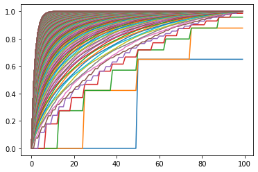
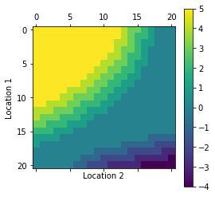

# MDP Basics and Dynamic Programming Methods

## Introduction
In this asignment we will be creating toy environments and map them to MDP based models. We have used dynamic programming and bootstrapping to implement these agents, which learn to navigate through the environment to maximize returns.

## :Files: File Structure
```bash
├── assignment.pdf
├── agent.py
├── env.py
├── main.ipynb
├── README.md
├── main.pdf
└── main_files

2 directories, 6 files
```
- **env.py** - Contanins code for the env in the Grid and Gambler problem. Details of the environment are given below in the appropriate sections.
- **agent.py** - Contains code for the various agents used.
- **assignment.pdf** - Contains details of the assignment.
- **main.ipynb** - Contains the plots of the policies generated by the various agents in different environments.
- **main.pdf** - contains .pdf format of the .ipynb notebook.

# Details of the various problems

## Problem-:one: : GridWorld

### Environment Setting
* The environment consists of a $8\times8$ grid with the start state as $(0,0)$ and terminal state as $(63,63)$.
* The reward for reaching the terminal state is $0$ else the reward $r(s,a,s^{'}) \in (0,-1)$.
* The possible actions in each stae are $\{Up = 0,Right = 1,Down = 2,Left = 3\}$.


```python
import env
import agent
import numpy as np
import matplotlib
import matplotlib.pyplot as plt
from mpl_toolkits.mplot3d import Axes3D
from matplotlib import cm


Env = env.Grid_1()
agent_1 = agent.ValueIteration(Env)
agent_2 = agent.PolicyIteration(Env)
agent_3 = agent.ConfusedAgent(Env)


```

* We train 3 agents corresponding to Value Iteration, Policy Iteration and Random.


```python
def plot(Env,policy,V):
    pp = np.reshape(np.argmax(policy, axis=1), Env.shape)
    print(pp)

    cmp = plt.matshow(np.reshape(V, Env.shape))
    # plt.arrow(0,0.5,0,-0.7,head_width = 0.1)

    plt.colorbar(cmp)

    for i in range(Env.shape[0]):
        for j in range(Env.shape[1]):
            if i == (Env.shape[0]-1) and j == (Env.shape[1]-1):
                continue
            if pp[i][j] == 0:
                plt.arrow(j,i+0.5,0,-0.7,head_width = 0.1)
            elif pp[i][j] == 2:
                plt.arrow(j,i-0.5,0,+0.7,head_width = 0.1)
            elif pp[i][j] == 1:
                plt.arrow(j-0.5,i,0.7,0,head_width = 0.1)
            elif pp[i][j] == 3:
                plt.arrow(j+0.5,i,-0.7,0,head_width = 0.1)
    
    plt.show()
    
    
    
```

### Function for plotting the optimal policies obtained by different agents

## Part-a,b

## Value-Iteration


```python
### Value Iteration
# agent_1.set_gamma(0.5)
agent_1.clear()
itr = 0
while True:
    agent_1.reset()
    agent_1.update()
    
    if agent_1.get_delta() < agent_1.get_threshold():
        break
    itr += 1
    
print(itr)
policy = agent_1.get_policy()
print(np.reshape(agent_1.V,Env.shape))
plot(Env,policy,agent_1.V)
# agent_1.clear()


```

    121
    [[-5.22041551 -4.66374662 -3.76022869 -3.51898212 -3.39792422 -3.27240293
      -3.53854272 -3.20898484]
     [-4.9694722  -4.4278591  -3.51898212 -3.39792422 -3.27240293 -3.1021674
      -2.68712729 -2.8775704 ]
     [-5.24781006 -4.71161351 -4.22887404 -3.31763094 -3.1021674  -2.68712729
      -2.16822194 -2.68712729]
     [-4.3842771  -4.22887404 -3.31763094 -3.15465386 -2.78012179 -2.16822194
      -1.72471154 -2.16822194]
     [-3.58602673 -3.53169027 -3.15465386 -2.63622143 -2.17376983 -1.72471154
      -1.52491241 -1.60236044]
     [-3.53169027 -3.19126    -2.63622143 -2.53203929 -2.01816864 -1.44891952
      -1.25594018 -0.62961128]
     [-3.58602673 -2.80017455 -2.53203929 -2.38232128 -1.44891952 -1.25594018
      -0.62961128  0.        ]
     [-4.07129585 -3.14357618 -2.80017455 -2.53203929 -1.6153412  -0.73101098
       0.          0.        ]]
    [[1 1 1 2 2 2 2 2]
     [1 1 1 1 1 2 2 2]
     [1 1 2 2 1 1 2 3]
     [2 1 1 2 2 1 2 3]
     [2 2 1 2 1 1 2 2]
     [1 1 1 2 1 2 2 2]
     [0 1 1 1 1 1 1 2]
     [1 1 0 0 1 1 1 0]]


1. In Value Iteration Algorithm, we initialize all the state values with $0$ and apply the Bellman optimality operator until the point of constantcy ($V^{*}$) is reached.

\begin{equation*}
V_{n+1}(s) = F(V_{n}(s)) = \max_{a \in A(s)}\bigg\{r(s,a) + \gamma \times \sum_{s^{'} \in S}P(s^{'}|s,a)V_{n}(s^{'})\bigg\} \forall s \in S
\end{equation*}

2. We get optimal policy using the following equation.


\begin{equation*}
\pi(s) = \arg\max_{a \in A(s)}\bigg\{r(s,a) + \gamma \times \sum_{s^{'} \in S}P(s^{'}|s,a)V_{n+1}(s^{'})\bigg\} \forall s \in S
\end{equation*}

3. In the above part we show the final state value vector and the optimal policy for $\gamma = 1$.


## Policy-Iteration


```python
### Policy Iteration
# agent_2.set_gamma(0.5)
agent_2.clear()
while True:
    V = agent_2.evaluate_policy()
    # print(V)

    stable = agent_2.update()

    if stable == True:
        break
        
print(np.reshape(agent_2.V,Env.shape))
plot(Env,agent_2.policy,agent_2.V)
# agent_2.clear()


```

    [[-5.22041551 -4.66374662 -3.76022869 -3.51898212 -3.39792422 -3.27240293
      -3.53854272 -3.20898484]
     [-4.9694722  -4.4278591  -3.51898212 -3.39792422 -3.27240293 -3.1021674
      -2.68712729 -2.8775704 ]
     [-5.24781006 -4.71161351 -4.22887404 -3.31763094 -3.1021674  -2.68712729
      -2.16822194 -2.68712729]
     [-4.3842771  -4.22887404 -3.31763094 -3.15465386 -2.78012179 -2.16822194
      -1.72471154 -2.16822194]
     [-3.58602673 -3.53169027 -3.15465386 -2.63622143 -2.17376983 -1.72471154
      -1.52491241 -1.60236044]
     [-3.53169027 -3.19126    -2.63622143 -2.53203929 -2.01816864 -1.44891952
      -1.25594018 -0.62961128]
     [-3.58602673 -2.80017455 -2.53203929 -2.38232128 -1.44891952 -1.25594018
      -0.62961128  0.        ]
     [-4.07129585 -3.14357618 -2.80017455 -2.53203929 -1.6153412  -0.73101098
       0.          0.        ]]
    [[1 1 1 2 2 2 2 2]
     [1 1 1 1 1 2 2 2]
     [1 1 2 2 1 1 2 3]
     [2 1 1 2 2 1 2 3]
     [2 2 1 2 1 1 2 2]
     [1 1 1 2 1 2 2 2]
     [0 1 1 1 1 1 1 2]
     [1 1 0 0 1 1 1 0]]


1. In Policy Iteration, we start with a random policy. This algorithm involves 2 parts:
    1. Policy Evaluation
    2. Policy Improvement
    
#### Policy Evaluation
1. In this we evaluate the current policy and return the final state value vector.
2. Evaluation is done using the following equation:-

\begin{equation*}
V_{n+1}(s) = \max_{a \in A(s)}\bigg\{\pi(a,s) \big\{r(s,a) + \gamma \times \sum_{s^{'} \in S}P(s^{'}|s,a)V_{n}(s^{'})\big\}\bigg\} \forall s \in S
\end{equation*}

#### Policy updation
1. We update the our current policy using the final state vector obtained from the policy evaluation step.
2. Improvement is done as follows:-

\begin{equation*}
\pi_{k+1}(s) = \arg\max_{a \in A(s)}\bigg\{r(s,a) + \gamma \times \sum_{s^{'} \in S}P(s^{'}|s,a)V_{\pi_{k}}(s^{'})\bigg\}
\end{equation*}


#### In the above part, we show the state value vector and optimal policy for Policy Iteration Algorithm.


```python
agent_3.get_policy()
print(np.reshape(agent_3.V,Env.shape))
plot(Env,agent_3.policy,agent_3.V)


```

    [[-0.04345    -0.55666888 -1.11333777 -2.0168557  -0.1255213  -0.17023553
      -0.53937516 -0.74397335]
     [-0.57585387 -0.53619655 -2.0168557  -2.92573268 -0.17023553 -0.29575683
      -0.33141444 -1.4879467 ]
     [-1.42734639 -1.07780964 -2.92573268 -0.16297707 -0.41504011 -0.46599235
      -0.19044311 -0.70934846]
     [-0.91915017 -1.83830034 -0.16297707 -0.51843243 -0.6814095  -1.47286136
      -0.19979913 -0.74597145]
     [-0.77347435 -2.69456567 -0.55503856 -1.04926075 -0.44905829 -2.33561133
      -2.78466962 -2.98446874]
     [-0.05433646 -0.94084391 -1.28127419 -1.56769318 -1.67187533 -0.19297934
      -0.76222846 -1.0312007 ]
     [-0.94084391 -0.26813526 -1.83631275 -0.36901193 -0.51872993 -0.6263289
      -0.73101098 -2.00394986]
     [-0.92771967 -0.92771967 -0.36901193 -0.71241356 -0.96835084 -0.81930824
      -1.70363847  0.        ]]
    [[0 0 3 3 2 2 0 1]
     [2 2 0 3 1 3 1 0]
     [0 0 0 2 1 0 1 3]
     [3 3 1 2 3 3 2 1]
     [1 0 2 3 1 0 3 3]
     [3 2 3 0 3 2 3 3]
     [1 1 0 2 3 1 2 0]
     [1 2 1 3 2 0 3 2]]


#### We observe that the final state value vectors and optimal policies is the same for both value iteration and policy iteration algorithm.

# Part-c


```python
def plot_mean_and_CI(mean, lb, ub, color_mean=None, color_shading=None):
    # plot the shaded range of the confidence intervals
    plt.fill_between(range(mean.shape[0]), ub, lb,
                     color=color_shading, alpha=.5)
    # plot the mean on top
    plt.plot(mean, color_mean)
    
    
    
```


```python
agent_1.clear()

mu = []
low = []
high = []

while True:
    agent_1.reset()
    agent_1.update()
    
#     mu.append((np.matrix(np.reshape(agent_1.V,Env.shape)))[0][0])
#     mu.append(agent_1.V[0][0])
    mat = np.matrix(np.reshape(agent_1.V,Env.shape))
    mu.append(mat[0,0])
    
    low.append((np.matrix(np.reshape(agent_1.V,Env.shape))).min())
    high.append((np.matrix(np.reshape(agent_1.V,Env.shape))).max())
    
    if agent_1.get_delta() < agent_1.get_threshold():
        break
        
mu = np.array(mu)
high = np.array(high)
low = np.array(low)

print(mu)
plot_mean_and_CI(mu, high, low, color_mean='g--', color_shading='g')


```

    [ 0.         -0.04345    -0.08689999 -0.13034999 -0.17379999 -0.21724999
     -0.26069998 -0.30414998 -0.34759998 -0.39104997 -0.43449997 -0.47794997
     -0.52139996 -0.56484996 -0.60829996 -0.65174996 -0.69519995 -0.73864995
     -0.78209995 -0.82554994 -0.86899994 -0.91244994 -0.95589993 -0.99934993
     -1.04279993 -1.08624993 -1.12969992 -1.17314992 -1.21659992 -1.26004991
     -1.30349991 -1.34694991 -1.3903999  -1.4338499  -1.4772999  -1.5207499
     -1.56419989 -1.60764989 -1.65109989 -1.69454988 -1.73799988 -1.78144988
     -1.82489988 -1.86834987 -1.91179987 -1.95524987 -1.99869986 -2.04214986
     -2.08559986 -2.12904985 -2.17249985 -2.21594985 -2.25939985 -2.30284984
     -2.34629984 -2.38974984 -2.43319983 -2.47664983 -2.52009983 -2.56354982
     -2.60699982 -2.65044982 -2.69389982 -2.73734981 -2.78079981 -2.82424981
     -2.8676998  -2.9111498  -2.9545998  -2.9980498  -3.04149979 -3.08494979
     -3.12839979 -3.17184978 -3.21529978 -3.25874978 -3.30219977 -3.34564977
     -3.38909977 -3.43254977 -3.47599976 -3.51944976 -3.56289976 -3.60634975
     -3.64979975 -3.69324975 -3.73669974 -3.78014974 -3.82359974 -3.86704974
     -3.91049973 -3.95394973 -3.99739973 -4.04084972 -4.08429972 -4.12774972
     -4.17119971 -4.21464971 -4.25809971 -4.30154971 -4.3449997  -4.3884497
     -4.4318997  -4.47534969 -4.51879969 -4.56224969 -4.60569969 -4.64914968
     -4.69259968 -4.73604968 -4.77949967 -4.82294967 -4.86639967 -4.90984966
     -4.95329966 -4.99674966 -5.04019966 -5.08364965 -5.12709965 -5.17054965
     -5.21399964 -5.22041551]


### Above is the plot for the average value of the optimal state value function v/s number of iterations for value iteration
1. We observe that as the number of iterations increases, the optimal reward value (average state value) converges to a constant value.


```python
agent_2.clear()
mu = []
low = []
high = []

while True:
    V = agent_2.evaluate_policy()
    
#     mu.append((np.matrix(np.reshape(V,Env.shape))).mean())
    mat = np.matrix(np.reshape(agent_2.V,Env.shape))
    mu.append(mat[0,0])
    low.append((np.matrix(np.reshape(V,Env.shape))).min())
    high.append((np.matrix(np.reshape(V,Env.shape))).max())
    
    stable = agent_2.update()
    
    if stable == True:
        break
        
mu = np.array(mu)
high = np.array(high)
low = np.array(low)

print(mu)
plot_mean_and_CI(mu, high, low, color_mean='b--', color_shading='b')


```

    [-192.41222849   -7.22184676   -6.25734004   -5.62044015   -5.22041551]


### Above is the plot for the average value of the optimal state value function v/s number of iterations for policy iteration
1. We observe that as the number of iterations increases, the optimal reward value (average state value) converges to a constant value.


```python
agent_3.clear()
mu = []
low = []
high = []

for i in range(100):
    agent_3.get_policy()
    
#     mu.append((np.matrix(np.reshape(agent_3.V,Env.shape))).mean())
    mat = np.matrix(np.reshape(agent_3.V,Env.shape))
    mu.append(mat[0,0])
    low.append((np.matrix(np.reshape(agent_3.V,Env.shape))).min())
    high.append((np.matrix(np.reshape(agent_3.V,Env.shape))).max())
        
mu = np.array(mu)
high = np.array(high)
low = np.array(low)

print(mu)
plot_mean_and_CI(mu, high, low, color_mean='b--', color_shading='b')


```

    [ -0.85149252  -0.89494252  -2.82045201  -3.04805649  -3.09150649
      -3.13495648  -3.17840648  -3.77852536  -4.92484152  -4.96829152
      -6.91806603  -6.96151602 -10.97207975 -14.5501409  -15.12599477
     -15.16944477 -14.34906268 -19.06797577 -19.11142576 -19.15487576
     -19.19832576 -19.24177576 -25.58355328 -25.62700328 -25.22381249
     -25.26726249 -25.31071249 -29.43737012 -29.48082012 -29.52427012
     -29.56772011 -30.46266263 -31.61107069 -31.65452069 -31.69797068
     -31.74142068 -31.78487068 -35.36977725 -40.98164786 -38.837261
     -38.88071099 -39.99404876 -41.26846264 -41.31191264 -43.21823714
     -43.26168714 -48.93040912 -49.83392705 -49.87737705 -49.92082704
     -45.59886027 -45.64231027 -45.68576027 -50.64489701 -50.68834701
     -50.731797   -54.98156821 -55.02501821 -57.51033007 -57.55378007
     -57.59723007 -58.19734895 -58.24079895 -58.28424894 -61.28885544
     -63.54599585 -63.58944585 -63.63289584 -64.23301473 -64.27646472
     -64.31991472 -64.36336472 -68.40375532 -68.44720532 -73.68853667
     -73.73198667 -71.04513289 -71.08858288 -71.13203288 -72.0269754
     -72.92191792 -72.96536792 -73.00881791 -73.05226791 -73.09571791
     -87.10745609 -87.15090609 -87.19435609 -89.14413059 -89.18758059
     -89.23103059 -91.5098695  -91.5533195  -91.59676949 -91.64021949
     -91.68366949 -91.72711949 -96.30590684 -97.76609365 -99.46831686]


* By seeing the above plots we conclude that that the rewards obtained by confused agent may be higher but on an average the confused agent performs poorly than the learned agents.
* We also observe that the final average state value is same for both value iteration and policy iteration.

## Comparison of different policies with different values of $\gamma$

### Value Iteration

### $\gamma = 0$


```python
agent_1.clear()

# policies_value = []
# V_value = []

agent_1.set_gamma(0)
while True:
    agent_1.reset()
    agent_1.update()
    
    if agent_1.get_delta() < agent_1.get_threshold():
        break
        
policy = agent_1.get_policy()
print(np.reshape(agent_1.V,Env.shape))
plot(Env,policy,agent_1.V)


```

    [[-0.14512055 -0.30882554 -0.30882554 -0.24017891 -0.19047494 -0.19047494
      -0.19047494 -0.30045085]
     [-0.14512055 -0.14512055 -0.29377688 -0.15884583 -0.24017891 -0.19047494
      -0.30045085 -0.36050373]
     [-0.14512055 -0.29377688 -0.15884583 -0.29377688 -0.15884583 -0.15183197
      -0.16053415 -0.44040548]
     [-0.27280255 -0.17011694 -0.06925676 -0.15884583 -0.15183197 -0.16053415
      -0.11034099 -0.16053415]
     [-0.27280255 -0.06925676 -0.47161264 -0.06925676 -0.09368626 -0.11034099
      -0.16053415 -0.11034099]
     [-0.36257063 -0.50018686 -0.06925676 -0.05339038 -0.10052064 -0.09368626
      -0.11034099 -0.41490262]
     [-0.4238164  -0.36257063 -0.05339038 -0.10052064 -0.05339038 -0.26303996
      -0.37154444  0.        ]
     [-0.36731126 -0.13121401 -0.13121401 -0.05339038 -0.09717174 -0.09717174
       0.          0.        ]]
    [[2 0 3 1 1 0 3 3]
     [3 3 2 2 0 0 0 3]
     [0 1 1 3 3 2 2 3]
     [3 0 2 0 1 1 2 3]
     [0 1 0 3 2 1 0 3]
     [1 2 0 2 3 3 0 0]
     [2 0 1 0 3 3 2 2]
     [1 1 2 0 2 3 1 0]]


### $\gamma = 0.1$


```python
agent_1.clear()

# policies_value = []
# V_value = []

agent_1.set_gamma(0.1)
while True:
    agent_1.reset()
    agent_1.update()
    
    if agent_1.get_delta() < agent_1.get_threshold():
        break
        
policy = agent_1.get_policy()
print(np.reshape(agent_1.V,Env.shape))
plot(Env,policy,agent_1.V)


```

    [[-0.16124344 -0.34313605 -0.34313605 -0.26134067 -0.21163671 -0.21163671
      -0.21163671 -0.32161262]
     [-0.16124344 -0.16124344 -0.31278745 -0.19012164 -0.26134067 -0.21163671
      -0.32161262 -0.39266309]
     [-0.16124344 -0.31278745 -0.19012164 -0.31278745 -0.19012164 -0.16916036
      -0.17329999 -0.45773387]
     [-0.30311091 -0.20139274 -0.11758913 -0.19012164 -0.16916036 -0.17329999
      -0.12766939 -0.17329999]
     [-0.30311091 -0.11758913 -0.48337086 -0.10692832 -0.10437809 -0.12766939
      -0.17329999 -0.12766939]
     [-0.41640676 -0.53837446 -0.10692832 -0.0640822  -0.10692832 -0.10437809
      -0.12766939 -0.42766846]
     [-0.462004   -0.38188914 -0.0640822  -0.10692832 -0.0640822  -0.26944764
      -0.37154444  0.        ]
     [-0.38188914 -0.14579189 -0.14579189 -0.0640822  -0.10796752 -0.10796752
       0.          0.        ]]
    [[2 0 3 1 1 0 3 3]
     [3 3 2 2 0 0 0 3]
     [0 1 1 3 3 2 2 3]
     [3 0 2 0 1 1 2 3]
     [0 1 0 2 2 1 0 3]
     [1 2 1 2 3 3 0 0]
     [2 2 1 0 3 3 2 2]
     [1 1 2 0 2 3 1 0]]


### $\gamma = 0.5$


```python
agent_1.clear()

# policies_value = []
# V_value = []

agent_1.set_gamma(0.5)
while True:
    agent_1.reset()
    agent_1.update()
    
    if agent_1.get_delta() < agent_1.get_threshold():
        break
        
policy = agent_1.get_policy()
print(np.reshape(agent_1.V,Env.shape))
plot(Env,policy,agent_1.V)


```

    [[-0.29023224 -0.61763222 -0.55453705 -0.43064222 -0.38093826 -0.38093826
      -0.38093826 -0.49091417]
     [-0.29023224 -0.29023224 -0.49758728 -0.40763051 -0.43064222 -0.38093826
      -0.49091417 -0.60595501]
     [-0.29023224 -0.49758728 -0.40763051 -0.49758728 -0.36935294 -0.29562629
      -0.28759844 -0.5841998 ]
     [-0.54558845 -0.41890161 -0.35296401 -0.36935294 -0.29562629 -0.28759844
      -0.25413532 -0.28759844]
     [-0.54558845 -0.35296401 -0.56741776 -0.16961688 -0.17849163 -0.25413532
      -0.28759844 -0.25413532]
     [-0.73728736 -0.74944148 -0.16961688 -0.13819575 -0.16961688 -0.17849163
      -0.25413532 -0.54196692]
     [-0.67307102 -0.49851726 -0.13819575 -0.16961688 -0.13819575 -0.3321362
      -0.37154444  0.        ]
     [-0.49851726 -0.26242001 -0.26242001 -0.13819575 -0.19433754 -0.19433754
       0.          0.        ]]
    [[2 0 1 1 1 0 3 3]
     [3 3 2 2 0 0 0 3]
     [0 1 1 3 2 2 2 3]
     [3 0 2 1 1 1 2 3]
     [0 1 1 2 2 1 0 3]
     [1 2 1 2 3 3 0 0]
     [2 2 1 0 3 3 2 2]
     [1 1 2 0 2 3 1 0]]


### $\gamma = 0.75$


```python
agent_1.clear()

# policies_value = []
# V_value = []

agent_1.set_gamma(0.75)
while True:
    agent_1.reset()
    agent_1.update()
    
    if agent_1.get_delta() < agent_1.get_threshold():
        break
        
policy = agent_1.get_policy()
print(np.reshape(agent_1.V,Env.shape))
plot(Env,policy,agent_1.V)


```

    [[-0.58046375 -0.93655564 -0.94790034 -0.81157952 -0.76187555 -0.76187555
      -0.76187555 -0.87185147]
     [-0.58046375 -0.58046375 -0.94376715 -0.86320238 -0.81157952 -0.69392968
      -0.85745711 -1.00359146]
     [-0.58046375 -0.94376715 -0.86666614 -0.94376715 -0.64820076 -0.5688836
      -0.55607352 -0.85745711]
     [-1.00943013 -0.87793725 -0.61193023 -0.64820076 -0.5688836  -0.55607352
      -0.52739263 -0.55607352]
     [-1.0298701  -0.61193023 -0.7235689  -0.3212776  -0.33464276 -0.52739263
      -0.55607352 -0.52739263]
     [-1.16573032 -1.07088514 -0.3212776  -0.29434688 -0.3212776  -0.33464276
      -0.52739263 -0.81044199]
     [-0.99451468 -0.76093661 -0.29434688 -0.3212776  -0.29434688 -0.48379693
      -0.37154444  0.        ]
     [-0.76093661 -0.52483936 -0.52483936 -0.29434688 -0.38867459 -0.37154444
       0.          0.        ]]
    [[2 3 1 1 1 0 3 3]
     [3 3 2 1 0 2 2 3]
     [0 1 1 3 2 2 2 3]
     [1 0 2 1 1 1 2 3]
     [0 1 1 2 2 1 0 3]
     [1 2 1 2 3 3 0 0]
     [2 2 1 0 3 3 2 2]
     [1 1 2 0 2 1 1 0]]


### $\gamma = 1$


```python
agent_1.clear()

# policies_value = []
# V_value = []

agent_1.set_gamma(1)
while True:
    
    agent_1.reset()
    agent_1.update()
    
    if agent_1.get_delta() < agent_1.get_threshold():
        break
        
policy = agent_1.get_policy()
print(np.reshape(agent_1.V,Env.shape))
plot(Env,policy,agent_1.V)


```

    [[-4.00052043 -3.87213884 -3.5688979  -3.22967614 -2.98949723 -2.79902229
      -2.59654604 -2.8969969 ]
     [-3.85539988 -3.15875858 -2.98864165 -2.94775684 -2.78891101 -2.21474088
      -2.23604231 -2.59654604]
     [-3.15875858 -2.98864165 -2.69486477 -2.78891101 -2.16901196 -1.9474688
      -1.79563683 -2.23604231]
     [-3.04585131 -2.69486477 -2.22325213 -2.15399537 -1.9474688  -1.79563683
      -1.63510268 -1.79563683]
     [-2.84204343 -2.22325213 -2.15399537 -1.67138298 -1.61115823 -1.63510268
      -1.52476168 -1.63510268]
     [-2.97756514 -2.61499451 -1.67138298 -1.57086235 -1.51747197 -1.52476168
      -0.76130864 -0.83198647]
     [-2.79131282 -2.29112596 -1.57086235 -1.51747197 -1.25443201 -0.76130864
      -0.37154444  0.        ]
     [-2.65161468 -2.28430342 -2.15308941 -1.25443201 -1.15726028 -0.37154444
       0.          0.        ]]
    [[2 2 1 1 1 2 2 3]
     [2 2 2 2 2 2 2 3]
     [1 1 2 1 2 2 2 3]
     [1 1 2 2 1 1 2 3]
     [1 1 1 2 2 1 2 3]
     [1 1 1 2 2 1 2 2]
     [1 1 1 1 2 1 2 2]
     [1 1 1 1 1 1 1 0]]


# Policy Iteration

### $\gamma = 0$


```python
agent_2.clear()
agent_2.set_gamma(0)
while True:
    V = agent_2.evaluate_policy()
    # print(V)

    stable = agent_2.update()

    if stable == True:
        break
        
print(np.reshape(agent_2.V,Env.shape))
plot(Env,agent_2.policy,agent_2.V)


```

    [[-0.14512055 -0.30882554 -0.30882554 -0.24017891 -0.19047494 -0.19047494
      -0.19047494 -0.30045085]
     [-0.14512055 -0.14512055 -0.29377688 -0.15884583 -0.24017891 -0.19047494
      -0.30045085 -0.36050373]
     [-0.14512055 -0.29377688 -0.15884583 -0.29377688 -0.15884583 -0.15183197
      -0.16053415 -0.44040548]
     [-0.27280255 -0.17011694 -0.06925676 -0.15884583 -0.15183197 -0.16053415
      -0.11034099 -0.16053415]
     [-0.27280255 -0.06925676 -0.47161264 -0.06925676 -0.09368626 -0.11034099
      -0.16053415 -0.11034099]
     [-0.36257063 -0.50018686 -0.06925676 -0.05339038 -0.10052064 -0.09368626
      -0.11034099 -0.41490262]
     [-0.4238164  -0.36257063 -0.05339038 -0.10052064 -0.05339038 -0.26303996
      -0.37154444  0.        ]
     [-0.36731126 -0.13121401 -0.13121401 -0.05339038 -0.09717174 -0.09717174
       0.          0.        ]]
    [[2 0 3 1 1 0 3 3]
     [3 3 2 2 0 0 0 3]
     [0 1 1 3 3 2 2 3]
     [3 0 2 0 1 1 2 3]
     [0 1 0 3 2 1 0 3]
     [1 2 0 2 3 3 0 0]
     [2 0 1 0 3 3 2 2]
     [1 1 2 0 2 3 1 0]]


### $\gamma = 0.1$


```python
agent_2.clear()
agent_2.set_gamma(0.1)
while True:
    V = agent_2.evaluate_policy()
    # print(V)

    stable = agent_2.update()

    if stable == True:
        break
        
print(np.reshape(agent_2.V,Env.shape))
plot(Env,agent_2.policy,agent_2.V)


```

    [[-0.16124344 -0.34313605 -0.34313605 -0.26134067 -0.21163671 -0.21163671
      -0.21163671 -0.32161262]
     [-0.16124344 -0.16124344 -0.31278745 -0.19012164 -0.26134067 -0.21163671
      -0.32161262 -0.39266309]
     [-0.16124344 -0.31278745 -0.19012164 -0.31278745 -0.19012164 -0.16916036
      -0.17329999 -0.45773387]
     [-0.30311091 -0.20139274 -0.11758913 -0.19012164 -0.16916036 -0.17329999
      -0.12766939 -0.17329999]
     [-0.30311091 -0.11758913 -0.48337086 -0.10692832 -0.10437809 -0.12766939
      -0.17329999 -0.12766939]
     [-0.41640676 -0.53837446 -0.10692832 -0.0640822  -0.10692832 -0.10437809
      -0.12766939 -0.42766846]
     [-0.462004   -0.38188914 -0.0640822  -0.10692832 -0.0640822  -0.26944764
      -0.37154444  0.        ]
     [-0.38188914 -0.14579189 -0.14579189 -0.0640822  -0.10796752 -0.10796752
       0.          0.        ]]
    [[2 0 3 1 1 0 3 3]
     [3 3 2 2 0 0 0 3]
     [0 1 1 3 3 2 2 3]
     [3 0 2 0 1 1 2 3]
     [0 1 0 2 2 1 0 3]
     [1 2 1 2 3 3 0 0]
     [2 2 1 0 3 3 2 2]
     [1 1 2 0 2 3 1 0]]


### $\gamma = 0.5$


```python
agent_2.clear()
agent_2.set_gamma(0.5)
while True:
    V = agent_2.evaluate_policy()
    # print(V)

    stable = agent_2.update()

    if stable == True:
        break
        
print(np.reshape(agent_2.V,Env.shape))
plot(Env,agent_2.policy,agent_2.V)


```

    [[-0.29023224 -0.61763222 -0.55453705 -0.43064222 -0.38093826 -0.38093826
      -0.38093826 -0.49091417]
     [-0.29023224 -0.29023224 -0.49758728 -0.40763051 -0.43064222 -0.38093826
      -0.49091417 -0.60595501]
     [-0.29023224 -0.49758728 -0.40763051 -0.49758728 -0.36935294 -0.29562629
      -0.28759844 -0.5841998 ]
     [-0.54558845 -0.41890161 -0.35296401 -0.36935294 -0.29562629 -0.28759844
      -0.25413532 -0.28759844]
     [-0.54558845 -0.35296401 -0.56741776 -0.16961688 -0.17849163 -0.25413532
      -0.28759844 -0.25413532]
     [-0.73728736 -0.74944148 -0.16961688 -0.13819575 -0.16961688 -0.17849163
      -0.25413532 -0.54196692]
     [-0.67307102 -0.49851726 -0.13819575 -0.16961688 -0.13819575 -0.3321362
      -0.37154444  0.        ]
     [-0.49851726 -0.26242001 -0.26242001 -0.13819575 -0.19433754 -0.19433754
       0.          0.        ]]
    [[2 0 1 1 1 0 3 3]
     [3 3 2 2 0 0 0 3]
     [0 1 1 3 2 2 2 3]
     [3 0 2 1 1 1 2 3]
     [0 1 1 2 2 1 0 3]
     [1 2 1 2 3 3 0 0]
     [2 2 1 0 3 3 2 2]
     [1 1 2 0 2 3 1 0]]


### $\gamma = 0.75$


```python
agent_2.clear()
agent_2.set_gamma(0.75)
while True:
    V = agent_2.evaluate_policy()
    # print(V)

    stable = agent_2.update()

    if stable == True:
        break
        
print(np.reshape(agent_2.V,Env.shape))
plot(Env,agent_2.policy,agent_2.V)


```

    [[-0.58046375 -0.93655564 -0.94790034 -0.81157952 -0.76187555 -0.76187555
      -0.76187555 -0.87185147]
     [-0.58046375 -0.58046375 -0.94376715 -0.86320238 -0.81157952 -0.69392968
      -0.85745711 -1.00359146]
     [-0.58046375 -0.94376715 -0.86666614 -0.94376715 -0.64820076 -0.5688836
      -0.55607352 -0.85745711]
     [-1.00943013 -0.87793725 -0.61193023 -0.64820076 -0.5688836  -0.55607352
      -0.52739263 -0.55607352]
     [-1.0298701  -0.61193023 -0.7235689  -0.3212776  -0.33464276 -0.52739263
      -0.55607352 -0.52739263]
     [-1.16573032 -1.07088514 -0.3212776  -0.29434688 -0.3212776  -0.33464276
      -0.52739263 -0.81044199]
     [-0.99451468 -0.76093661 -0.29434688 -0.3212776  -0.29434688 -0.48379693
      -0.37154444  0.        ]
     [-0.76093661 -0.52483936 -0.52483936 -0.29434688 -0.38867459 -0.37154444
       0.          0.        ]]
    [[2 3 1 1 1 0 3 3]
     [3 3 2 1 0 2 2 3]
     [0 1 1 3 2 2 2 3]
     [1 0 2 1 1 1 2 3]
     [0 1 1 2 2 1 0 3]
     [1 2 1 2 3 3 0 0]
     [2 2 1 0 3 3 2 2]
     [1 1 2 0 2 1 1 0]]


### $\gamma = 1$


```python
agent_2.clear()
agent_2.set_gamma(1)
while True:
    V = agent_2.evaluate_policy()
    # print(V)

    stable = agent_2.update()

    if stable == True:
        break
        
print(np.reshape(agent_2.V,Env.shape))
plot(Env,agent_2.policy,agent_2.V)


```

    [[-4.00052043 -3.87213884 -3.5688979  -3.22967614 -2.98949723 -2.79902229
      -2.59654604 -2.8969969 ]
     [-3.85539988 -3.15875858 -2.98864165 -2.94775684 -2.78891101 -2.21474088
      -2.23604231 -2.59654604]
     [-3.15875858 -2.98864165 -2.69486477 -2.78891101 -2.16901196 -1.9474688
      -1.79563683 -2.23604231]
     [-3.04585131 -2.69486477 -2.22325213 -2.15399537 -1.9474688  -1.79563683
      -1.63510268 -1.79563683]
     [-2.84204343 -2.22325213 -2.15399537 -1.67138298 -1.61115823 -1.63510268
      -1.52476168 -1.63510268]
     [-2.97756514 -2.61499451 -1.67138298 -1.57086235 -1.51747197 -1.52476168
      -0.76130864 -0.83198647]
     [-2.79131282 -2.29112596 -1.57086235 -1.51747197 -1.25443201 -0.76130864
      -0.37154444  0.        ]
     [-2.65161468 -2.28430342 -2.15308941 -1.25443201 -1.15726028 -0.37154444
       0.          0.        ]]
    [[2 2 1 1 1 2 2 3]
     [2 2 2 2 2 2 2 3]
     [1 1 2 1 2 2 2 3]
     [1 1 2 2 1 1 2 3]
     [1 1 1 2 2 1 2 3]
     [1 1 1 2 2 1 2 2]
     [1 1 1 1 2 1 2 2]
     [1 1 1 1 1 1 1 0]]


* We observe that different values of $\gamma$ result in different policies.
* If value of $\gamma \to 0$, then the agent focusses on short term gains and acts greedily.
* If the value of $\gamma \to 1$, then the agent will put more weight on long term gains and will not act greedily.
* In our MDP, as $\gamma \to 1$, we obtain a better policy.

# Question- 3

## Part-a

#### The problem can be modelled as a MDP tuple $<S,A,P,R>$ where :
1. $S$ is the set of all possible states of the gambler.
\begin{equation*}
S = \big\{\$ 0 \dots \$100\big\}
\end{equation*}

where $S = \$0$ and $S = \$100$ are terminal states.

2. $A$ is the set of all possible bets he can place in a given state $s \in S$.

\begin{equation*}
A(s) = \big\{1 \dots \min(s,100-s) \big\}
\end{equation*}

3. $R(s,a,s^{'})$ is 0 if $s^{'} \in \big\{\$ 0 \dots \$99 \big\}$ else 1.

4. Given a state $s$, if the gambler makes a bet of $a \in \big\{1 \dots \min(s,100-s)\big\}$, then $s^{'}$ can be:
    1. $s+a$ with $P(head)$
    2. $s-a$ with $1-P(head)$
\begin{equation*}
\therefore
P(s,a,s+a) = P(head)\\
P(s,a,s-a) = 1-P(head)
\end{equation*}

#### Bellman Equation for value iteration
1. The Bellman Update Equation for this problem will be as follows:

\begin{equation*}
V_{n+1}(s) = \max_{a \in A(s)}\bigg\{P(head) \times\bigg(r(s+a,a) + \gamma \times V_{n}(s+a)\bigg )+ \big\{1-P(head)\big \} \times\bigg(r(s-a,a) + \gamma \times V_{n}(s-a)\bigg )\bigg\} \forall s \in S
\end{equation*}

## Part-b


```python
Gambler_env = env.Gambler_env()
Gambler_env.set_p_h(0.3)
agent_1 = agent.Gambler_ValueIteration(Gambler_env)
Gambler_env.set_p_h(0.15)
agent_2 = agent.Gambler_ValueIteration(Gambler_env)
Gambler_env.set_p_h(0.65)
agent_3 = agent.Gambler_ValueIteration(Gambler_env)


```


```python
def plot_fig1(y):
    x = range(100)
    
    for i in range(1,len(y)):
        plt.plot(x,y[i][:100])
    plt.show()
    
    
    
```


```python
def plot_fig2(policy):
    x = range(100)
    
    plt.bar(x,policy)
    
    plt.show()
    
    
    
```

## Plots showing the iterations of Value Iteration Algorithm and the optimal policy for different values of $P(head)$

### $P(head) = 0.3$


```python
agent_1.clear()
y = []
while True:

    agent_1.reset()
    agent_1.update()
    
    y.append(agent_1.V)

    if agent_1.get_delta() < agent_1.get_threshold():
        break
        
policy = agent_1.get_policy()
print(agent_1.get_policy())
print(agent_1.V)


```

    [ 0.  1.  2.  3.  4.  5.  6.  7.  8.  9. 10. 11. 12. 12. 11. 15.  9.  8.
      7.  6.  5. 21.  3.  2.  1. 25.  1.  2.  3.  4.  5.  6.  7.  8.  9. 10.
     11. 13. 38. 11. 10.  9.  8.  7.  6.  5.  4.  3.  2.  1. 50. 49.  2.  3.
      4.  5.  6.  7.  8.  9. 10. 11. 12. 12. 11. 10.  9. 33.  7.  6. 20.  4.
      3.  2.  1. 25.  1.  2.  3.  4.  5.  6.  7.  8. 16. 10. 11. 12. 12. 11.
     10.  9.  8.  7.  6.  5.  4.  3.  2.  1.]
    [0.00000000e+00 2.66917018e-04 8.89723393e-04 1.92325355e-03
     2.96574464e-03 4.32158176e-03 6.41084517e-03 8.50388325e-03
     9.88581548e-03 1.18309578e-02 1.44052725e-02 1.77664658e-02
     2.13694839e-02 2.71868419e-02 2.83462775e-02 3.00251072e-02
     3.29527183e-02 3.52816705e-02 3.94365260e-02 4.60307893e-02
     4.80175751e-02 5.16971693e-02 5.92215525e-02 6.31880185e-02
     7.12316130e-02 9.00000000e-02 9.06228064e-02 9.20760213e-02
     9.44875916e-02 9.69200708e-02 1.00083691e-01 1.04958639e-01
     1.09842394e-01 1.13066903e-01 1.17605568e-01 1.23612303e-01
     1.31455087e-01 1.39862129e-01 1.53435964e-01 1.56141314e-01
     1.60058584e-01 1.66889676e-01 1.72323898e-01 1.82018561e-01
     1.97405175e-01 2.02041008e-01 2.10626728e-01 2.28183623e-01
     2.37438710e-01 2.56207097e-01 3.00000000e-01 3.00622806e-01
     3.02076021e-01 3.04487592e-01 3.06920071e-01 3.10083691e-01
     3.14958639e-01 3.19842394e-01 3.23066903e-01 3.27605568e-01
     3.33612303e-01 3.41455087e-01 3.49862129e-01 3.63435964e-01
     3.66141314e-01 3.70058584e-01 3.76889676e-01 3.82323898e-01
     3.92018561e-01 4.07405175e-01 4.12041008e-01 4.20626728e-01
     4.38183623e-01 4.47438710e-01 4.66207097e-01 5.10000000e-01
     5.11453215e-01 5.14844050e-01 5.20471047e-01 5.26146832e-01
     5.33528612e-01 5.44903490e-01 5.56298920e-01 5.63822773e-01
     5.74412993e-01 5.88428706e-01 6.06728536e-01 6.26344968e-01
     6.58017250e-01 6.64329733e-01 6.73470028e-01 6.89409244e-01
     7.02089095e-01 7.24709975e-01 7.60612075e-01 7.71429020e-01
     7.91462366e-01 8.32428453e-01 8.54023656e-01 8.97816560e-01
     0.00000000e+00]


```python
plot_fig1(y)
plot_fig2(policy)


```


### $P(head) = 0.15$


```python
agent_2.clear()
y = []
while True:

    agent_2.reset()
    agent_2.update()
    
    y.append(agent_2.V)

    if agent_2.get_delta() < agent_2.get_threshold():
        break
        
policy = agent_2.get_policy()
print(policy)
print(agent_2.V)


```

    [ 0.  1.  2.  3.  4.  5.  6.  7.  8.  9. 10. 11. 12. 12. 11. 10.  9.  8.
      7.  6.  5.  4.  3.  2.  1. 25.  1.  2.  3.  4.  5.  6. 32.  8.  9. 10.
     11. 13. 38. 11. 10.  9.  8.  7.  6.  5.  4.  3.  2. 49. 50.  1.  2.  3.
      4.  5.  6.  7.  8.  9. 10. 11. 12. 13. 11. 10. 16.  8.  7.  6.  5.  4.
      3.  2.  1. 25.  1.  2.  3.  4.  5.  6. 18. 17.  9. 10. 11. 13. 12. 11.
     10.  9.  8.  7.  6.  5.  4.  3.  2.  1.]
    [0.00000000e+00 1.92759560e-06 1.28536475e-05 3.73999231e-05
     8.57080408e-05 1.42805249e-04 2.49880557e-04 5.10991667e-04
     5.71386939e-04 6.72316904e-04 9.52034995e-04 1.30250559e-03
     1.66587038e-03 3.37663800e-03 3.40670777e-03 3.49636996e-03
     3.80934292e-03 3.94646937e-03 4.48212975e-03 6.24514185e-03
     6.34689997e-03 6.72948446e-03 8.68337057e-03 9.09506179e-03
     1.11058025e-02 2.25000000e-02 2.25109230e-02 2.25728373e-02
     2.27119329e-02 2.29856789e-02 2.33092297e-02 2.39159898e-02
     2.53956194e-02 2.57378593e-02 2.63097958e-02 2.78948650e-02
     2.98808650e-02 3.19399321e-02 4.16342820e-02 4.18046774e-02
     4.23127631e-02 4.40862765e-02 4.48633264e-02 4.78987352e-02
     5.78891372e-02 5.84657665e-02 6.06337453e-02 7.17057666e-02
     7.40386835e-02 8.54328810e-02 1.50000000e-01 1.50010923e-01
     1.50072837e-01 1.50211933e-01 1.50485679e-01 1.50809230e-01
     1.51415990e-01 1.52895619e-01 1.53237859e-01 1.53809796e-01
     1.55394865e-01 1.57380865e-01 1.59439932e-01 1.69134282e-01
     1.69304677e-01 1.69812763e-01 1.71586277e-01 1.72363326e-01
     1.75398735e-01 1.85389137e-01 1.85965766e-01 1.88133745e-01
     1.99205767e-01 2.01538684e-01 2.12932881e-01 2.77500000e-01
     2.77561897e-01 2.77912745e-01 2.78700953e-01 2.80252180e-01
     2.82085635e-01 2.85523942e-01 2.93908510e-01 2.95847869e-01
     2.99088843e-01 3.08070902e-01 3.19324902e-01 3.30992949e-01
     3.85927598e-01 3.86893172e-01 3.89772324e-01 3.99822234e-01
     4.04225516e-01 4.21426166e-01 4.78038444e-01 4.81306010e-01
     4.93591223e-01 5.56332677e-01 5.69552540e-01 6.34119659e-01
     0.00000000e+00]


```python
plot_fig1(y)
plot_fig2(policy)


```


### $P(head) = 0.65$


```python
agent_3.clear()
y = []
while True:

    agent_3.reset()
    agent_3.update()

    y.append(agent_3.V)
    if agent_3.get_delta() < agent_3.get_threshold():
        break
        
policy = agent_3.get_policy()
print(policy)
print(agent_3.V)


```

    [0. 1. 1. 1. 1. 1. 1. 1. 1. 1. 1. 1. 1. 1. 1. 1. 1. 1. 1. 1. 1. 1. 1. 1.
     1. 2. 2. 2. 2. 2. 2. 2. 2. 2. 2. 2. 2. 2. 2. 2. 2. 2. 2. 2. 2. 2. 2. 2.
     2. 2. 2. 2. 2. 2. 2. 2. 2. 2. 2. 2. 2. 2. 2. 2. 2. 2. 2. 2. 2. 2. 2. 2.
     2. 2. 2. 2. 2. 2. 2. 2. 2. 2. 2. 2. 2. 2. 2. 2. 1. 1. 1. 1. 1. 1. 1. 1.
     1. 1. 1. 1.]
    [0.         0.46137334 0.70981407 0.84360309 0.91565822 0.9544721
     0.97538609 0.98666051 0.99274307 0.99602866 0.99780691 0.99877234
     0.99929903 0.99958853 0.99974948 0.99984048 0.9998932  0.99992476
     0.99994446 0.99995737 0.99996628 0.99997274 0.99997763 0.99998147
     0.99998454 0.99998706 0.99998911 0.99999081 0.9999922  0.99999336
     0.99999432 0.99999513 0.9999958  0.99999638 0.99999686 0.99999728
     0.99999763 0.99999794 0.9999982  0.99999843 0.99999862 0.9999988
     0.99999894 0.99999907 0.99999919 0.99999929 0.99999938 0.99999945
     0.99999952 0.99999958 0.99999963 0.99999968 0.99999972 0.99999975
     0.99999978 0.99999981 0.99999984 0.99999986 0.99999987 0.99999989
     0.99999991 0.99999992 0.99999993 0.99999994 0.99999995 0.99999995
     0.99999996 0.99999997 0.99999997 0.99999998 0.99999998 0.99999998
     0.99999998 0.99999999 0.99999999 0.99999999 0.99999999 0.99999999
     0.99999999 1.         1.         1.         1.         1.
     1.         1.         1.         1.         1.         1.
     1.         1.         1.         1.         1.         1.
     1.         1.         1.         1.         0.        ]


```python
plot_fig1(y)
plot_fig2(policy)


```





## Part-c

### $\theta = 0.00000000000000001$


```python
agent_1.set_threshold(0.00000000000000001)
agent_1.clear()
y = []
while True:

    agent_1.reset()
    agent_1.update()

    y.append(agent_1.V)
    if agent_1.get_delta() < agent_1.get_threshold():
        break
        
policy = agent_1.get_policy()
print(policy)
print(agent_1.V)


```

    [ 0.  1.  2.  3.  4.  5.  6.  7.  8.  9. 10. 11. 12. 13. 11. 15.  9. 17.
      7.  6.  5.  4.  3.  2.  1. 25.  1.  2.  3.  4. 30.  6.  7.  8.  9. 10.
     11. 13. 12. 11. 10.  9.  8.  7.  6.  5.  4.  3.  2.  1. 50.  1.  2.  3.
      4.  5.  6.  7.  8.  9. 10. 11. 12. 12. 11. 10.  9. 33.  7.  6.  5.  4.
     28.  2.  1. 25.  1.  2.  3.  4.  5.  6.  7.  8.  9. 15. 11. 12. 12. 11.
     10.  9.  8.  7.  6.  5.  4.  3.  2.  1.]
    [0.00000000e+00 2.66917018e-04 8.89723393e-04 1.92325355e-03
     2.96574464e-03 4.32158176e-03 6.41084517e-03 8.50388325e-03
     9.88581548e-03 1.18309578e-02 1.44052725e-02 1.77664658e-02
     2.13694839e-02 2.71868419e-02 2.83462775e-02 3.00251072e-02
     3.29527183e-02 3.52816705e-02 3.94365260e-02 4.60307893e-02
     4.80175751e-02 5.16971693e-02 5.92215525e-02 6.31880185e-02
     7.12316130e-02 9.00000000e-02 9.06228064e-02 9.20760213e-02
     9.44875916e-02 9.69200708e-02 1.00083691e-01 1.04958639e-01
     1.09842394e-01 1.13066903e-01 1.17605568e-01 1.23612303e-01
     1.31455087e-01 1.39862129e-01 1.53435964e-01 1.56141314e-01
     1.60058584e-01 1.66889676e-01 1.72323898e-01 1.82018561e-01
     1.97405175e-01 2.02041008e-01 2.10626728e-01 2.28183623e-01
     2.37438710e-01 2.56207097e-01 3.00000000e-01 3.00622806e-01
     3.02076021e-01 3.04487592e-01 3.06920071e-01 3.10083691e-01
     3.14958639e-01 3.19842394e-01 3.23066903e-01 3.27605568e-01
     3.33612303e-01 3.41455087e-01 3.49862129e-01 3.63435964e-01
     3.66141314e-01 3.70058584e-01 3.76889676e-01 3.82323898e-01
     3.92018561e-01 4.07405175e-01 4.12041008e-01 4.20626728e-01
     4.38183623e-01 4.47438710e-01 4.66207097e-01 5.10000000e-01
     5.11453215e-01 5.14844050e-01 5.20471047e-01 5.26146832e-01
     5.33528612e-01 5.44903490e-01 5.56298920e-01 5.63822773e-01
     5.74412993e-01 5.88428706e-01 6.06728536e-01 6.26344968e-01
     6.58017250e-01 6.64329733e-01 6.73470028e-01 6.89409244e-01
     7.02089095e-01 7.24709975e-01 7.60612075e-01 7.71429020e-01
     7.91462366e-01 8.32428453e-01 8.54023656e-01 8.97816560e-01
     0.00000000e+00]


```python
plot_fig1(y)
plot_fig2(policy)


```


### $\theta = 0.00000000000001$


```python
agent_1.set_threshold(0.00000000000001)
agent_1.clear()
y = []
while True:

    agent_1.reset()
    agent_1.update()

    y.append(agent_1.V)
    if agent_1.get_delta() < agent_1.get_threshold():
        break
        
policy = agent_1.get_policy()
print(policy)
print(agent_1.V)


```

    [ 0.  1.  2.  3.  4.  5.  6.  7.  8.  9. 10. 11. 12. 12. 11. 15.  9.  8.
      7.  6.  5. 21.  3.  2.  1. 25.  1.  2.  3.  4.  5.  6.  7.  8.  9. 10.
     11. 13. 38. 11. 10.  9.  8.  7.  6.  5.  4.  3.  2.  1. 50. 49.  2.  3.
      4.  5.  6.  7.  8.  9. 10. 11. 12. 12. 11. 10.  9. 33.  7.  6. 20.  4.
      3.  2.  1. 25.  1.  2.  3.  4.  5.  6.  7.  8. 16. 10. 11. 12. 12. 11.
     10.  9.  8.  7.  6.  5.  4.  3.  2.  1.]
    [0.00000000e+00 2.66917018e-04 8.89723393e-04 1.92325355e-03
     2.96574464e-03 4.32158176e-03 6.41084517e-03 8.50388325e-03
     9.88581548e-03 1.18309578e-02 1.44052725e-02 1.77664658e-02
     2.13694839e-02 2.71868419e-02 2.83462775e-02 3.00251072e-02
     3.29527183e-02 3.52816705e-02 3.94365260e-02 4.60307893e-02
     4.80175751e-02 5.16971693e-02 5.92215525e-02 6.31880185e-02
     7.12316130e-02 9.00000000e-02 9.06228064e-02 9.20760213e-02
     9.44875916e-02 9.69200708e-02 1.00083691e-01 1.04958639e-01
     1.09842394e-01 1.13066903e-01 1.17605568e-01 1.23612303e-01
     1.31455087e-01 1.39862129e-01 1.53435964e-01 1.56141314e-01
     1.60058584e-01 1.66889676e-01 1.72323898e-01 1.82018561e-01
     1.97405175e-01 2.02041008e-01 2.10626728e-01 2.28183623e-01
     2.37438710e-01 2.56207097e-01 3.00000000e-01 3.00622806e-01
     3.02076021e-01 3.04487592e-01 3.06920071e-01 3.10083691e-01
     3.14958639e-01 3.19842394e-01 3.23066903e-01 3.27605568e-01
     3.33612303e-01 3.41455087e-01 3.49862129e-01 3.63435964e-01
     3.66141314e-01 3.70058584e-01 3.76889676e-01 3.82323898e-01
     3.92018561e-01 4.07405175e-01 4.12041008e-01 4.20626728e-01
     4.38183623e-01 4.47438710e-01 4.66207097e-01 5.10000000e-01
     5.11453215e-01 5.14844050e-01 5.20471047e-01 5.26146832e-01
     5.33528612e-01 5.44903490e-01 5.56298920e-01 5.63822773e-01
     5.74412993e-01 5.88428706e-01 6.06728536e-01 6.26344968e-01
     6.58017250e-01 6.64329733e-01 6.73470028e-01 6.89409244e-01
     7.02089095e-01 7.24709975e-01 7.60612075e-01 7.71429020e-01
     7.91462366e-01 8.32428453e-01 8.54023656e-01 8.97816560e-01
     0.00000000e+00]


```python
plot_fig1(y)
plot_fig2(policy)


```


1. We see from the above plots that as $\theta \to 0$, the state value matrix and the optimal policy becomes stable for $P(head) = 0.3$

# Question-2

## Part-a

#### The problem can be modelled as a MDP tuple $<S,A,P,R>$ where :
1. $S$ is the set of all possible states $(s_1,s_2)$ where $s_i$ is the number of cars at location $i$.
\begin{equation*}
S = \big\{ (0,0) \dots (20,20)\big\}
\end{equation*}

2. $A$ is the set of all possible movement of cars that can be done given a state $s = (s_1,s_2)$.

\begin{equation*}
A(s) = \big\{-min(5,s_2), \dots ,+min(5,s_1)\big\}
\end{equation*}

3. Let number of cars rented at location 1 and location 2 be $r_1$ and $r_2$ respectively and cars returned be $c_1$ and $c_2$.That is, given $s = (s_1,s_2)$, $s^{'} = (s_1-r_1+r_2+c_1,s_2-r_2+r_1+c_2)$.

4. $\therefore$ $R(s,a,s^{'}) = (r_1+r_2)\times \$10 - (c_1+c_2) \times \$2$. where $r_1,r_2,c_1,c_2$ are sampled from poisson's distribution with $\lambda_{rent1} = 3, \lambda_{rent2} = 4$,$\lambda_{return1} = 3, \lambda_{return2} = 4$.

5. Given a state $s$, if number of cars moved are $(c_1,c_2)$ and final state is $s^{'}$, then:

\begin{equation*}
    P(s,a,s^{'}) = \frac{\lambda_{return1}^{c_1}}{c_1!}\exp^{-\lambda_{return1}}\times \frac{\lambda_{return2}^{c_2}}{c_2!}\exp^{-\lambda_{return2}}
\end{equation*}

### Assumption: I have assumed an upper bound of 8 on the number of cars that can be rented or returned as $P(E) \to 0$ for $E \geq 8$.

#### Bellman Equation for policy iteration
1. The Bellman Update Equation for this problem will be as follows:

    1. Policy evaluation:
    Let $a$ be the action determined by $\pi$.

\begin{equation*}
V_{n+1}(s) = \pi(a|s) \times \bigg\{ \sum_{rent_1}\sum_{rent_2}\sum_{return_1}\sum_{return_2} P(rent)\times P(return)\times \big\{R(s_1,a,s_2) + \gamma \times V_{n}(s_1,s_2)\big\}\bigg\} \forall (s_1,s_2 )\in S
\end{equation*}
    2. Policy Improvement:
    
\begin{equation*}
\pi_{k+1}(s) = \arg\max_{a \in A} V_{\pi}(s)
\end{equation*}
    

## Part-b


```python
def three_dimentional_plot(V):
    fig = plt.figure()
    ax = fig.gca(projection = '3d')
    X = np.arange(0,V.shape[0],1)
    Y = np.arange(0,V.shape[1],1)
    X,Y = np.meshgrid(X,Y)
    surf = ax.plot_surface(X,Y,V,rstride = 1,cstride = 1,cmap = cm.coolwarm,linewidth = 0,antialiased = False)
    ax.set_xlabel('Location 2')
    ax.set_ylabel('Location 1')
    plt.show()
    
    
    
    
```


```python
def plot_policy(all_P):
    itr = 0
    for pi in all_P:
        cmp = plt.matshow(pi)
        plt.xlabel('Location 2')
        plt.ylabel('Location 1')
        plt.colorbar(cmp)
    plt.show()
    
    
    
    
```


```python
Jack_env = env.Jack_env()
agent_1 = agent.Jack_PolicyIteration(Jack_env)


all_V = []
all_P = []

all_P.append(agent_1.policy.copy())

while True:
    agent_1.evaluate_policy()
    stable = agent_1.update()

    all_V.append(agent_1.V.copy())
    all_P.append(np.flip(agent_1.policy.copy(),0))
    if stable == True:
        break
        
        
```


```python
        
plot_policy(all_P)


```





```python
three_dimentional_plot(agent_1.V)


```


### Part-c


```python
Jack_env = env.Jack_env()
agent_2 = agent.Jack_PolicyIteration_2(Jack_env)


all_V = []
all_P = []

all_P.append(agent_2.policy.copy())

while True:
    agent_2.evaluate_policy()
    stable = agent_2.update()

    all_V.append(agent_2.V.copy())
    all_P.append(np.flip(agent_2.policy.copy(),0))
    if stable == True:
        break
        
        
```


```python
plot_policy(all_P)


        
        
```


```python
three_dimentional_plot(agent_2.V)

```


